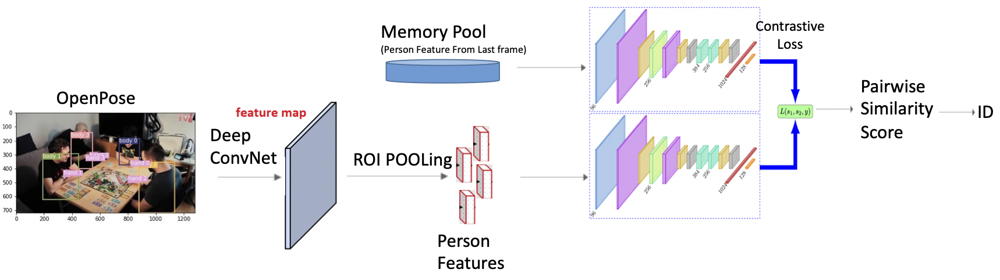
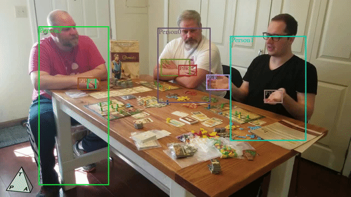
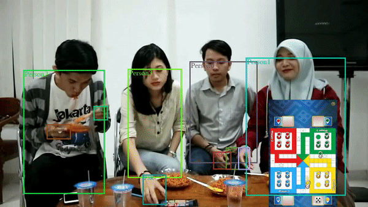
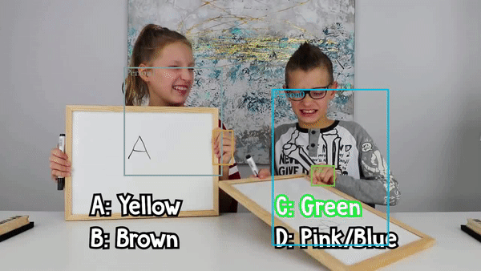
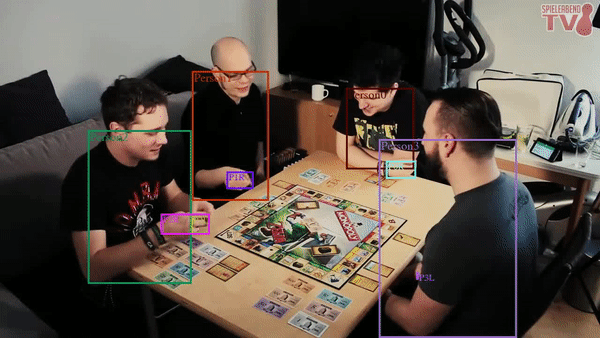

# Online Multi-hands Tracking via Discrimination


> [**Online Multi-hands Tracking via Discrimination**](https://sites.google.com/andrew.cmu.edu/mht),            
> Qichen Fu, Jiaqi Geng, Sirou Zhu        
> *16-824: Visual Learning and Recognition (Spring 2021)*
## Abstract
Hands are becoming a focus in computer vision to understand how humans interact with objects but hands tracking is still a challenge due to the similar photometric textures among hands and the presence of common occlusion during the manipulation. This repository contains three different methods: 

1. Simple baseline using Hungarian Algorithm and Kuhn-Munkres Algorithm, 
2. Hand Tracking using Body Clue as auxiliary information with OpenPose
3. Online Multi-hands Tracking via Discrimination and Memory Cache. We trained a siamese network to verify the identity of person.  
### Video demos on the sampled 100 Days of Hand dataset
   
   


## Installation

* Clone this repo, and we'll call the directory that you cloned as ${MHT_ROOT}
* Install dependencies. We use python 3.7 and pytorch >= 1.2.0
```
conda create -n mht
conda activate mht
conda install pytorch torchvision torchaudio cudatoolkit=10.2 -c pytorch
cd ${MHT_ROOT}
pip install -r requirements.txt
```
* We use [FairMOT](https://github.com/ifzhang/FairMOT) as the human tracker and more details can be found in their repo. It uses [DCNv2](https://github.com/CharlesShang/DCNv2) in their backbone network and more details can be found in their repo. 
```
git clone https://github.com/CharlesShang/DCNv2
cd DCNv2
./make.sh
```

## Data preparation

* **Multi-hands sequence**
We sampled several sequences with multi-hands from the videos used by [100DOH](https://fouheylab.eecs.umich.edu/~dandans/projects/100DOH/) datasets. The sampled sequence and human labeled ground truth could be downloaded from [[Google Drive](https://www.crowdhuman.org)]. After downloading, you should prepare the data in the following structure:
```
data
   |——————handobj_detections
   |        └——————vid1
   |                 └——————frames
   |                 └——————anno_img
   |                 └——————person_anno
   |                 └——————frames_det_meta
   |                 └——————frames_det_meta_openpose
   |        └——————...
   |        └——————vid8
   └——————labels
```
## Training
* Download the training data
* Change the dataset root directory 'root' in src/lib/cfg/data.json and 'data_dir' in src/lib/opts.py
* Run:
```
sh experiments/person_train_doh100.sh
```

## Tracking
* Run method 1 (baseline model):

```
Python src/hand_tracking.py --root_dir data
```

* Run method 2 (with FairMOT):
```
cd src
python track.py hand --test_handDoh True --load_model ../exp/hand/person-detector-doh-full/model_last.pth --gpus 0 --conf_thres 0.3
```
to see the tracking results. You can also set save_images=True in src/track.py to save the visualization results of each frame. 

* Run method 3 (with siamese model):
```
Python tracking_siamese.py --root_dir data
```


## Acknowledgement
A large part of the code is borrowed from [ifzhang/FairMOT](https://github.com/ifzhang/FairMOT). Thanks for their wonderful works.

## Citation

```
@article{mht2020,
  title={Online Multi-hands Tracking via Discrimination},
  url="https://sites.google.com/andrew.cmu.edu/mht",
  author={Qichen Fu, Jiaqi Geng, Sirou Zhu},
  year={2020}
}
```

